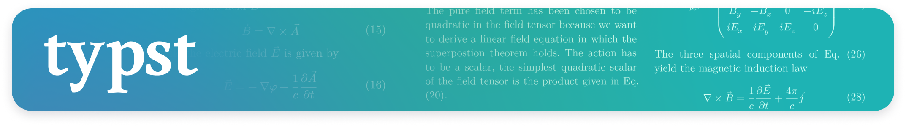
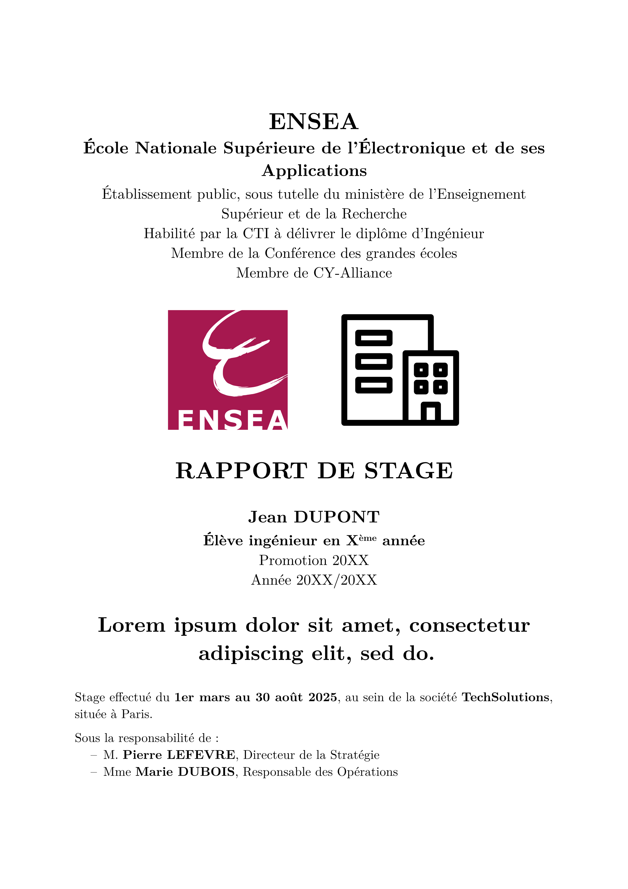

# ENSEA - Typst Template (unofficial)

  

  
Custom templates for documents made at ENSEA.

<!-- ## Letter template: for short documents

[README](https://github.com/Dawod-G/ENSEA_Typst-Template/blob/master/src/README-letter.md)

  

 -->

## Lab template: for lab reports (v0.1.0)

[Typst Universe](https://typst.app/universe/package/volt-lab-ensea) \
[README](https://github.com/Dawod-G/ENSEA_Typst-Template/blob/main/volt-lab-ensea/0.1.0/README.md)

  
  

## Internship template: for internship reports (v0.1.2)

[Typst Universe](https://typst.app/universe/package/volt-internship-ensea) \
[README](https://github.com/Dawod-G/ENSEA_Typst-Template/blob/main/volt-internship-ensea/0.1.2/README.md)

  
  
   
  
  
   
  
  

## Contributions

If you find any issues or have suggestions for improvements, feel free to open an issue or submit a pull request. 

## License

The Typst template is licensed under the [MIT license](https://github.com/Dawod-G/ENSEA_Typst-Template/blob/master/LICENSE.md). This license does not apply to the ENSEA logo or associated image files, which remain the property of ENSEA.